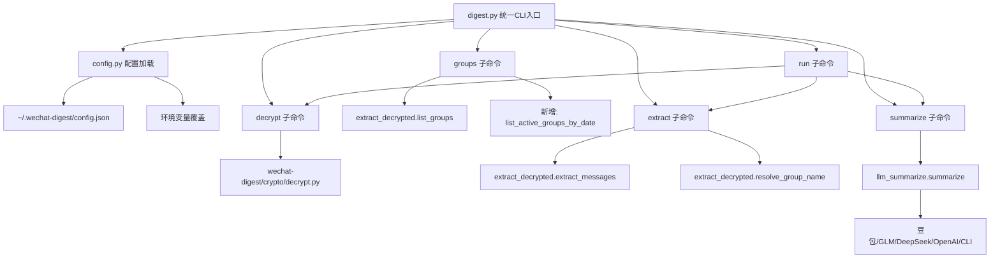

## 用户需求

1. **验证跑通**：以 AI 实践群 2026-04-13 为例，验证完整链路（解密 → 提取 → LLM 摘要）能否跑通
2. **敏感信息外置**：把 API Key、DB 密钥等硬编码值从源码中移除，改为环境变量/配置文件
3. **Agent 友好交互**：设计更适合 agent 调用的 CLI 结构（分步操作、JSON 输出等）
4. **架构优化**：消除重复代码、统一配置体系、修复已知 bug

## 核心问题（通过代码审查确认）

**安全：3处敏感信息硬编码**

- `run_doubao.py:96` — 豆包 API Key `66e9a0b0-...`
- `decrypt_active.py:98` — DB 密钥 `49f459a3...`
- `test_doubao.py:5-6` — 两种格式 API Key

**架构：5个根目录脚本完全绕过 wechat-digest 已有模块**

- `run_doubao.py` 和 `extract_apr15.py` 各自重复实现了消息提取逻辑（decompress + format_msg），而 `wechat-digest/extract_decrypted.py` 已有完善的 `extract_messages()` + `resolve_group_name()` + `list_groups()`
- `decrypt_active.py` 重复实现了 SQLCipher4 + WAL 解密，而 `wechat-digest/crypto/decrypt.py` 已有完全相同的 `full_decrypt()` + `decrypt_wal()`
- 群名映射散落在各脚本中，`extract_decrypted.py` 有 `KNOWN_GROUPS` 字典 + `config.json known` 字段，但都是空的
- `llm_summarize.py` 已有完善的多 LLM 提供商支持 + 环境变量配置，但 `run_doubao.py` 自己实现了简化版的豆包调用

**配置：config.json 过时**

- `~/.wechat-digest/config.json` 的 `db_dir` 指向旧目录 `E:\Documents\WeChatFiles\...`（非活跃！）
- `known` 字段为空 `{}`
- 缺少 LLM 配置和 DB 密钥配置

**Bug：llm_summarize.py 两处错误**

- 第139行 `date_date` 应为 `date_str`（NameError）
- 第271行 `datetime.datetime` 但 `datetime` 在 `__main__` 块才 import（NameError）

**Agent 友好：缺失能力**

- `extract_decrypted.py` 没有「按日期列出活跃群」功能（这是 `find_ai_practice.py` 的独有能力）
- 没有 `--json` 输出模式
- 错误处理不够结构化

## Tech Stack

纯 Python 3.12 + PowerShell，无新依赖：

- **核心语言**: Python 3.12
- **关键依赖**: pycryptodome, zstandard, requests（已安装）
- **LLM**: 火山引擎豆包 API（已验证）
- **配置存储**: `~/.wechat-digest/config.json`（已有体系）

## Implementation Approach

### 核心策略：复用 wechat-digest 模块 + 创建统一 CLI 入口

不重写 wechat-digest 内部代码，而是：

1. 修复 wechat-digest 内部 bug（`llm_summarize.py` 的2处 NameError）
2. 补充 wechat-digest 的缺失能力（按日期列群、--json 输出）
3. 创建根目录统一 CLI 入口 `digest.py`，复用 wechat-digest 模块
4. 旧5个脚本不删除，保留为 `scripts/archive/` 中的参考

### 统一 CLI 设计（`digest.py`）

```
python digest.py decrypt                     # 解密数据库（复用 crypto/decrypt.py）
python digest.py groups [--date YYYY-MM-DD] [--json]  # 列出群聊（复用+扩展）
python digest.py extract <group> <date> [--json]      # 提取消息（复用 extract_decrypted）
python digest.py summarize <group> <date>             # LLM摘要（复用 llm_summarize）
python digest.py run <group> <date>                   # 一键全流程
python digest.py test-api                             # 测试LLM连接
python digest.py config [--show|--fix]                # 配置管理
```

### 配置外置方案

更新 `~/.wechat-digest/config.json`：

```
{
  "db_dir": "E:\\文档\\WeChatFiles\\...\\db_storage\\message",
  "wx_data_dir": "E:\\文档\\WeChatFiles\\...\\db_storage",
  "output_dir": "e:\\微信群聊总结\\output",
  "decrypted_dir": "e:\\微信群聊总结\\wetrace-bin\\wetrace\\data",
  "known": {
    "AI实践": "49710605556@chatroom"
  }
}
```

敏感值优先从环境变量读取：

- `WECHAT_DB_KEY` — 数据库密钥（替代硬编码）
- `WECHAT_LLM_API_KEY` — LLM API 密钥
- 已有：`LLM_API_KEY`、`LLM_PROVIDER`、`LLM_MODEL`（`llm_summarize.py` 已支持）

### Agent 友好设计

- 所有子命令支持 `--json` 输出结构化数据
- `groups --date 2026-04-13 --json` 输出 `[{name, username, msg_count}]`
- `extract` 输出到 stdout（agent 可直接捕获文本）
- 错误统一为 JSON `{"error": "..."}` 格式（`--json` 模式下）

### 0413 验证计划

分步验证，每步确认：

1. `python digest.py decrypt` — 解密数据库
2. `python digest.py groups --date 2026-04-13` — 确认 AI 实践群有消息
3. `python digest.py extract AI实践 2026-04-13` — 提取消息
4. `python digest.py summarize AI实践 2026-04-13` — LLM 摘要

## Architecture Design



## Implementation Notes

1. **crypto/config.py 的 auto_detect_db_dir() 有已知问题**：在 Windows 上它读取 ini 文件找数据目录，但可能指向旧目录。需要增加「活跃目录验证」逻辑——比较两个候选目录的 message_0.db 修改时间
2. **extract_decrypted.py 的 DEFAULT_DECRYPTED_DIR 是硬编码**：改为从 config.json 读取 decrypted_dir 字段，回退到当前硬编码值
3. **llm_summarize.py 的 date_date bug**：第139行 `date_date` 改为 `date_str`，顶部加 `import datetime`
4. **0413 验证的关键风险**：message_active/message_0.db 是4月15日解密的，0413 数据应该在里面（解密后数据覆盖3月13日到解密时刻）。但如果微信在4月13日到4月15日之间做了 checkpoint，WAL 中的4月13日数据可能已经合并到主 .db 文件——这意味着即使不解密 WAL，4月13日的数据也应该存在
5. **blast radius 控制**：不修改 wechat-digest/ 内部文件（除了 bugfix），新 CLI 入口文件 `digest.py` 放在根目录