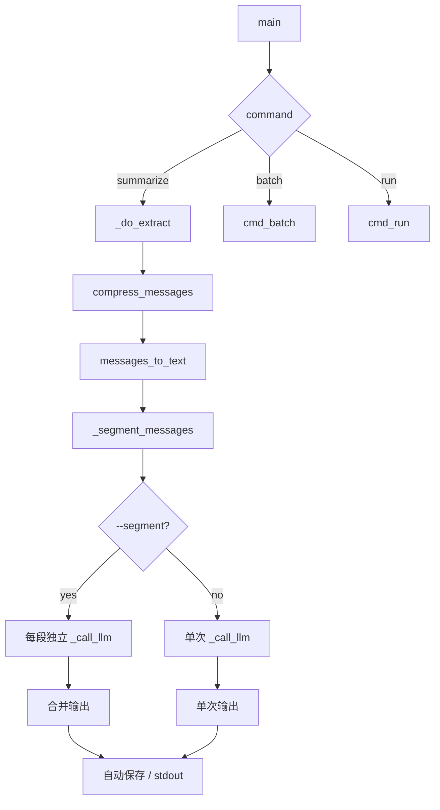

## Product Overview

对 digest.py 进行 V3 全面优化，根据用户反馈重新聚焦三大方向：深度上下文工程（去掉无用信息而非加统计元数据）、增量/分段摘要（核心新功能）、架构易用性与代码健壮性。

## Core Features

### 上下文工程 -- 聚焦"去掉无用信息"

- type=49 链接消息在 compact 模式下只保留标题，省略长 URL（LLM 不需要 URL 生成摘要）
- 话题边界标记从 `[HH:MM]` 升级为 `── [HH:MM] ──`，更语义清晰
- type=1 文本消息中过滤微信群系统提示（如撤回提示、红包提示等无讨论价值的内容）
- 发言者匿名化 `--anon`：按发言频次映射为 用户A/用户B/...，消除昵称泄漏风险

### 增量 & 分段摘要（新核心功能）

- `--since HH:MM` 增量参数：只提取指定时间之后的消息，配合自动追加模式
- `--segment` 分段摘要：按时间段自动切分（默认4小时），每段独立调 LLM，合并输出
- 摘要缓存（TTL 12h）：避免对同一数据重复调 API 浪费 token

### 架构易用性

- date 参数支持 today/yesterday 字符串，默认值为 yesterday
- 不传 `--output` 时自动保存到 output 目录
- batch 子命令：批量生成多天摘要
- 修复 `--no-cache` 全局参数与子命令不连通的 bug

### 代码健壮性

- DEFAULT_PROVIDERS 提取为模块级常量
- cmd_run 智能跳过已解密状态，正确透传 args
- 新增 `--quiet` 参数静默进度输出

## Tech Stack

- Python 3.12, 标准库（argparse, sqlite3, json, re, datetime, hashlib, urllib, dataclasses, tempfile, time, io, os, sys）
- 可选依赖: zstandard, pycryptodome
- LLM: OpenAI-compatible Chat Completions API

## Implementation Approach

分层渐进优化，全部改动集中在 digest.py 单文件内。按风险递增顺序执行：

**阶段1 -- 纯 bug fix 和技术债（零功能风险）**

- DEFAULT_PROVIDERS 提取为 `LLM_PROVIDERS` 模块常量，`_call_llm` 和 `cmd_test_api` 统一引用
- 修复 `--no-cache` 全局参数：main() 解析后将 `args.no_cache` 同步到所有子命令 args
- date 参数支持 today/yesterday 字符串解析，summarize/run/extract 的 date 设为 nargs='?' default='yesterday'

**阶段2 -- 上下文压缩优化（只影响 compact 输出格式）**

- `_parse_messages`: type=49 消息新增 `_referenced_summary` 字段（从 XML 的 `<referencedmessage>` 标签提取）
- `compress_messages`: QUOTE_NOISE 之外，新增引用折叠逻辑 -- 引用摘要 <=20字折叠为 `[→引用摘要]`，>20字截取前15字+省略号
- `messages_to_text`: compact 模式下 type=49 的 body 只输出 `[链接] {title}`，省略 URL；话题边界升级为 `── [HH:MM] ──`
- `messages_to_text`: 新增 `anon_map=None` 参数，传入时将发言者名替换为映射标签
- 新增 `SYSTEM_MSG_PATTERNS` 正则列表，在 `_parse_messages` 的 type=1 分支中过滤系统提示

**阶段3 -- 增量摘要 + 自动保存 + 摘要缓存 + --quiet**

- `_extract_raw_rows` 新增 `since_offset=0` 参数（小时精度），修改 ts_start 为 `ts_start + since_offset*3600`
- `_do_extract` 透传 since_offset
- 摘要缓存：`load_summary_cache(group, date, compact, since, prompt_hash, max_age=43200)` + `save_summary_cache()`
- 自动保存路径：`output/{safe_group_name}/{date}.md`（群名中的特殊字符替换为下划线）
- `--since HH:MM` 配合自动追加：文件存在时追加分隔符+新内容
- 引入 `logging` 模块，`--quiet` 时设 WARNING 级别，正常时设 INFO 级别

**阶段4 -- 分段摘要 + --anon + batch + cmd_run 修复**

- `_segment_messages(messages, gap_hours=4)`: 按时间间隔切分消息段
- `cmd_summarize` 增加 `--segment` 分支：对每段独立调 `_call_llm`，合并输出
- `--anon` 在 cmd_summarize 中计算发言频次映射，传入 `messages_to_text`
- `cmd_batch`: 解析日期范围或 `--last-n`，循环调用 `_do_extract` + `_call_llm`
- `cmd_run`: 检查 `decrypted_dir` 是否有文件，有则跳过 decrypt；删除多余 args 透传

## Implementation Notes

- `_parse_messages` 中 type=49 的 referencedmessage 提取需用 `re.search(r'<referencedmessage>(.*?)</referencedmessage>', text, re.DOTALL)`，然后从中提取 title/appmsg 标签
- `--since HH:MM` 解析为 `int(hh)*60 + int(mm)` 分钟偏移，传入 `_extract_raw_rows` 的 `since_offset` 参数（单位分钟，内部除以3600转小时加到 ts_start）
- 分段摘要的 gap_hours=4 意味着：如果两段消息间隔 >= 4小时则切分，空段跳过
- `--anon` 映射算法：`collections.Counter(msg.sender_id for msg in messages).most_common()`，频次降序分配 用户A/B/C...
- 批量模式的错误处理：单日失败不中断，stderr 报错并继续下一天
- logging 替换：保留所有 `print(..., file=sys.stderr)` 的调用点，替换为 `log.info()`/`log.warning()`

## Architecture Design

单文件架构，内部函数调用关系：



## Directory Structure

```
e:\微信群聊总结\
├── digest.py                  # [MODIFY] 所有改动集中于此
│   ├── LLM_PROVIDERS          # [MODIFY] 从 _call_llm/cmd_test_api 提取的模块常量
│   ├── SYSTEM_MSG_PATTERNS    # [NEW] 系统消息过滤正则列表
│   ├── _parse_messages()      # [MODIFY] type=49 提取引用摘要, type=1 过滤系统消息
│   ├── compress_messages()    # [MODIFY] 引用折叠逻辑
│   ├── messages_to_text()     # [MODIFY] URL省略, 话题边界升级, --anon 支持
│   ├── _segment_messages()    # [NEW] 按时间间隔切分消息段
│   ├── _extract_raw_rows()    # [MODIFY] 新增 since_offset 参数
│   ├── _do_extract()          # [MODIFY] 透传 since_offset
│   ├── _call_llm()            # [MODIFY] 引用 LLM_PROVIDERS 常量
│   ├── cmd_summarize()        # [MODIFY] --segment/--since/--anon, 自动保存, 摘要缓存
│   ├── cmd_batch()            # [NEW] 批量摘要子命令
│   ├── cmd_run()              # [MODIFY] 跳过已解密, args 透传
│   └── main()                 # [MODIFY] date默认值, --quiet, --no-cache连通, --since/--segment/--anon参数
└── output/                    # 自动保存目录（已存在）
    └── {group_name}/          # [AUTO] 按群名分子目录
```

本任务为纯后端 CLI 工具优化，不涉及 UI 设计变更。