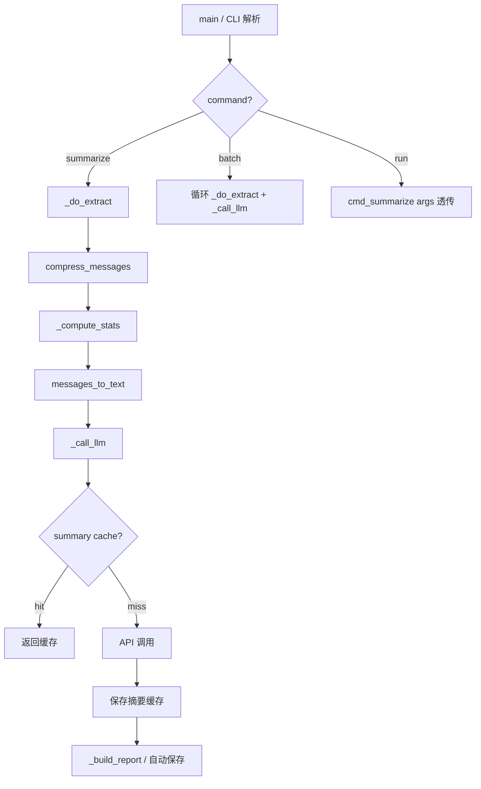

## Product Overview

对 digest.py 进行 V3 全面优化，覆盖上下文工程、摘要实用性、架构易用性、代码健壮性四个维度。

## Core Features

### 上下文工程

- 在 LLM user_content 开头注入结构化元数据块（总消息数、活跃时段、Top发言人分布），让 LLM 无需自行推断统计信息
- compact 模式下话题边界标记升级为语义化分隔符 `--- [HH:MM] ---`
- compact 模式下链接消息（type=49）只保留标题，省略长 URL
- 新增 `--anon` 参数：发言者匿名化为 A/B/C/...（按发言频次排序），彻底消除昵称泄漏风险

### 摘要实用性

- Prompt 模板改进：活跃时段从元数据直接获取（不再让 LLM 猜测），资源分享表格增加 few-shot 示例
- 新增摘要缓存（TTL 12h），与 extract 缓存独立管理
- 摘要质量统计输出（字数、章节数）

### 架构易用性

- date 参数支持 "today"/"yesterday" 字符串，默认值为 yesterday
- 不传 `--output` 时自动保存报告到 `output/{group}/{date}.md`
- 新增 `batch` 子命令：支持 `batch "AI实践" 2026-04-13:2026-04-16` 或 `--last-n 7`
- 修复 `--no-cache` 全局参数与子命令参数不连通的 bug

### 代码健壮性

- DEFAULT_PROVIDERS 提取为模块级常量，消除 `_call_llm` 和 `cmd_test_api` 两处重复定义
- cmd_run 透传完整 args，避免 decrypt 在已解密时仍强制运行
- 新增 `--quiet` 参数静默进度输出
- 提取 `_compute_stats()` 函数统一计算发言统计，供元数据注入和摘要质量统计复用

## Tech Stack

- Python 3.12 (当前环境)
- 标准库: argparse, sqlite3, json, re, datetime, hashlib, urllib, dataclasses, tempfile, time, io, os, sys
- 依赖: zstandard (可选), pycryptodome (可选)
- LLM: OpenAI-compatible Chat Completions API (当前配置 doubao)

## Implementation Approach

分层渐进式优化，优先实现高价值低风险的改动（P0），再推进推荐改动（P1），最后处理可选改动（P2）。所有改动集中在 digest.py 单文件内，不新增文件。

核心策略：

1. **先修 bug 和技术债**（P0）：DEFAULT_PROVIDERS 去重、--no-cache 全局参数连通、date 默认值
2. **再改上下文管道**（P0+P1）：_compute_stats()、元数据注入、链接URL省略、话题边界标记、--anon
3. **最后改用户体验**（P1+P2）：自动保存、batch 子命令、摘要缓存、--quiet

## Implementation Notes

- `_compute_stats()` 返回结构化字典：`{total, peak_hours, top_senders: [(name, count)], msg_types: {type: count}}`
- 元数据注入格式：在 `_call_llm` 的 user_content 开头追加 `[统计]` 块，约 100-150 字符，对 token 预算影响可忽略
- 摘要缓存 key：`summary_{group}_{date}_{compact}_{prompt_hash}`，存于 `~/.wechat-digest/cache/`
- batch 子命令内部循环调用 `_do_extract` + `_call_llm`，不新建独立 extract 逻辑
- --anon 通过在 `messages_to_text` 中按发言频次排序后分配 A/B/C 标签实现，原始消息不修改
- date 默认值改为 yesterday 是因为"今天"的数据通常不完整（当天还在产生消息）

## Architecture Design

单文件架构不变，优化内部函数组织：



## Directory Structure

```
e:\微信群聊总结\
├── digest.py              # [MODIFY] V3 优化主文件，所有改动集中于此
│   ├── 常量区             # [MODIFY] DEFAULT_PROVIDERS 提取为模块级常量
│   ├── _compute_stats()   # [NEW] 统一发言统计函数
│   ├── messages_to_text() # [MODIFY] 支持话题边界标记、URL 省略、--anon
│   ├── compress_messages()# [MODIFY] 无重大改动
│   ├── _call_llm()        # [MODIFY] 元数据注入、摘要缓存、去除内联 DEFAULT_PROVIDERS
│   ├── cmd_summarize()    # [MODIFY] 自动保存、摘要质量统计
│   ├── cmd_batch()        # [NEW] batch 子命令处理函数
│   ├── cmd_run()          # [MODIFY] args 透传、跳过已解密时的 decrypt
│   └── main()             # [MODIFY] date 默认值/yesterday、--quiet、--no-cache 连通
└── wechat-digest/
    └── prompt-template.txt # [MODIFY] 同步更新：活跃时段从元数据读取、增加 few-shot 示例
```

本任务为纯后端 CLI 工具优化，不涉及 UI 设计，无需设计章节。